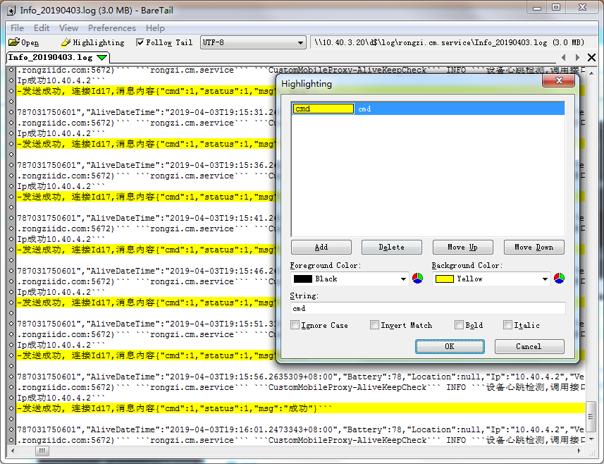

# baretail工具介绍   

## 背景  
- 测试的时候经常看日志，每次都要自己手动重新加载，然后在搜索过滤   

## 安装
- 免安装，下载地址在同路径文件夹下  

## 软件简介  
- 免安装，只有200KB    
- 支持大文件查看
- 支持查看网络文件
- 支持实时滚动
- 支持查看多个文件
- 支持过滤高亮
- 没必要使用Pro版本，Pro版本只增加了查找、过滤和导出，但对中文支持的不好  

## 使用截图
     