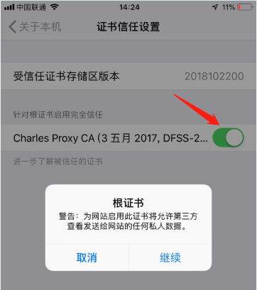
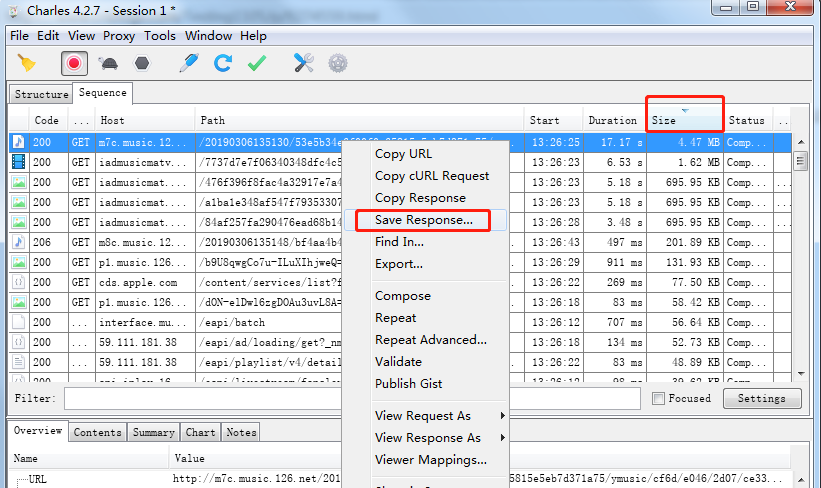

## Charles基础使用  
#### 一、Charles配置  
1. 安装与破解省略。。。  
2. windows本机不抓包（去掉勾选windows proxy）  
      
3. 设置Charles端口（默认8899）  
      
4. https设置（设置为*:443也可以）  
         
5. 设置接口想要访问的代理(http和https都设置下)  
      
    
#### 二、android手机配置   
1. 导出cer文件，不是pem格式  
      
2. 将cer文件放到手机存储中，并在安全和隐私中‘从存储设备安装’进行安装  
      
3. 安装的时候会要求设置密码  
      
4. 在手机设置中的WIFI界面，查看当前使用的网络详情  
      
5. 查看代理ip和端口  
      
      
6. 选择代理为手动、设置上面查到的代理ip和端口，保存~    
      
    
#### 三、ios手机设置   
1. 查看代理ip和端口  
      
      
2. 设置上面查到的代理ip和端口，保存  
       
          
      
3. 打开safari浏览器，地址栏输入chls.pro/ssl，一路允许、安装到底  
      
4. 打开手机设置--通用--关于本机最下方的证书信任设置，然后信任证书  
      
    
## Charles进阶使用  
#### 一、过滤  
1. Charles记录过滤：  
    打开菜单栏的Proxy--Recording Settings中的Include页签  
    '*'代表任何字符或者字符串，按勾选的进行过滤，一个都没勾，就不过滤  
      
2. 关键字过滤：  
    ①界面有结构和列表两种显示方式，选择列表方式  
    ②右键列表的空白处可以指定新增各种列  
    ③输入关键词，可以进行过滤  
    ④勾选regex后，可以在输入框中使用正则表达式进行过滤  
      
    
#### 二、限速  
1. 打开菜单栏的Proxy--Throttle Settings    
2. 勾选Enable Throttling，然后修改下方的参数就可以调整网速了（也可以模拟4G和3G）  
3. 如果需要对置顶网址进行限速，可以打开only for selected hosts  
       
4. 如果不想限速了，直接把菜单栏上的小乌龟按钮点一下，置灰就可以了  

#### 三、复制&压力
1. 复制请求：  
    右键请求，选择compose，编辑入参后，点击execute发送请求    
       
2. 重复发送同一请求（压力）：  
    右键请求，选择repeat advanced（见上图），编辑次数和并发数，点击确定，立即执行  
           
    
#### 四、断点  
1. 右键请求，选择breakpoints，在手机上重新请求，可以编辑请求入参  
       
    接口返回后，可以编辑返回数据  
           
2. 在菜单栏proxy--breakpoints settings中，可以管理所有打断点的接口  
    双击接口url，可以设置断点请求还是断点返回（默认两个都是勾选的）   
              
3. 菜单上也有断点的总开关（六边形的按钮）  

#### 五、map local（用本地文件替换接口返回数据）  
1. 在Charles界面查看某个请求的返回json，复制修改后保存为本地的一个json文件  
2. 右键这个请求，选择Map Loacl...，填入本地json文件的路径  
         
3. 在手机上重新请求这个接口，就会返回修改过的数据  
      
4. 不需要时，可以在Tools-Map Local中关掉这个接口的配置  

#### 六、map remote（重定向请求）  
1. 在Charles的菜单中，选择Tools--Map Remote  
    例如：可以将baidu.com指向bing.com  
    也可以用来指向不同的测试、线上环境    
         
    这里把所有的mi.rongzi.com都指向了QA环境   
    因为QA环境的ip访问不支持https，所以设置中强制从https转http了  
2. 支持匹配    

    | 符号 | 说明           |
    | ---- | ------------------- |
    | *    | 匹配0个或者多个字符 |
    | ?    | 匹配一个字符        |

3. Map To配置  
    
    | host举例     | 说明                 |
    | ------------ | -------------------- |
    | *.rongzi.com | 所有rongzi域名的请求 |
    
    | path举例        | 说明                              |
    | --------------- | --------------------------------- |
    | /product/       | product目录下                     |
    | /product/*      | 支持product目录和子目录           |
    | /product/*.html | product目录和子目录的所有html文件 |
    
#### 七、抓数据   
1. 拿网易云音乐举例，播放一首音乐  
2. 抓取到接口后，按大小排序  
3. 右键MP3那条记录，保存下来就是MP3音乐文件了  
       

#### 八、反向代理  
没有测试场景使用到，不研究了。。。  
 

