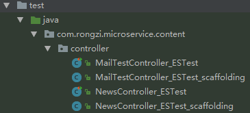
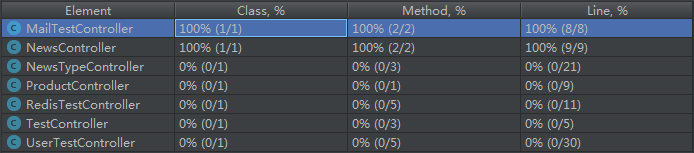

## 核心功能：
1. 测试过程运行在一个沙盒中，避免潜在危险
2. 自动生成单元测试用例集
3. .......我还在研究中^~^

## 链接：
##### [github地址](https://github.com/EvoSuite/evosuite)
##### [官网](http://www.evosuite.org/)

## 安装依赖：
```xml
<dependency>
   <groupId>junit</groupId>
   <artifactId>junit</artifactId>
   <version>4.12</version>
   <scope>test</scope>
</dependency>
<dependency>
   <groupId>org.evosuite</groupId>
   <artifactId>evosuite-standalone-runtime</artifactId>
   <version>1.0.6</version>
   <scope>test</scope>
</dependency>

<plugin>
	<groupId>org.evosuite.plugins</groupId>
	<artifactId>evosuite-maven-plugin</artifactId>
	<version>1.0.6</version>
</plugin>
```

## 执行语句：

##### 简单全量版：
```
mvn evosuite:generate
```

##### 定制版：
```
mvn compile -DmemoryInMB=2000 -Dcores=2 -Dcuts=com.rongzi.micservice.xxx -DtargetFolder=src/test/java/evosuite evosuite:generate evosuite:export
```

##### 说明：

| 指令                | 说明                                                     |
| ------------------- | -------------------------------------------------------- |
| compile             | 表示编译。因为工具是基于编译后的 .class   文件生成用例的 |
| -DmemoryInMB=2000   | 表示使用   2000MB 内存                                   |
| -Dcores=2           | 表示用2个   cpu加速                                      |
| -Dcuts=....         | 表示只对xxx这个类生成用例，多个用例用英文逗号分隔        |
| -DtargetFolder=.... | 指定用例的输出目录                                       |
| evosuite:generate   | 生成用例命令                                             |
| evosuite:export     | 不清楚....                                               |

PS：不指定生成路径，默认在src/test/java目录下  
  

## 生成的用例:
 

##### 说明:
1. NewsController_ESTest.java：测试用例文件
2. NewsController_ESTest_scaffolding.java：用例基类，个人理解是初始化evosuite沙盒

##### 通过Junit测试，覆盖率如下（覆盖率不高，但有效代码基本都覆盖了）：
 


## 部分用例详情：

```java
@Test(timeout = 4000)
public void test0()  throws Throwable  {
    MailUtil mailUtil0 = mock(MailUtil.class, new ViolatedAssumptionAnswer());
    MailTestController mailTestController0 = new MailTestController(mailUtil0);
    ResultVO<Boolean> resultVO0 = mailTestController0.send("", "", "");
    assertEquals(0, resultVO0.getStatus());
}

@Test(timeout = 4000)
public void test1()  throws Throwable  {
    MailTestController mailTestController0 = new MailTestController((MailUtil) null);
    // Undeclared exception!
    try { 
      mailTestController0.send("i$50", "", "`");
      fail("Expecting exception: NullPointerException");
    
    } catch(NullPointerException e) {
       //
       // no message in exception (getMessage() returned null)
       //
       verifyException("com.rongzi.microservice.content.controller.MailTestController", e);
    }
}

@Test(timeout = 4000)
public void test0()  throws Throwable  {
    NewsController newsController0 = new NewsController();
    CmsNewsService cmsNewsService0 = mock(CmsNewsService.class, new ViolatedAssumptionAnswer());
    doReturn((Object) null).when(cmsNewsService0).selectByPrimaryKey(anyLong());
    Injector.inject(newsController0, (Class<?>) NewsController.class, "cmsNewsService", (Object) cmsNewsService0);
    Injector.validateBean(newsController0, (Class<?>) NewsController.class);
    ResultVO<CtCmsNews> resultVO0 = newsController0.GetNewsById((-1613L));
    System.out.println(resultVO0.getMessage());
    assertNull(resultVO0.getMessage());
    
}
```


##### 学习总结：

- 大多数都是异常场景的用例，不知道是否可以配置生成正常用例?
- 虽然还需要人工处理，已经大大提高效率了
- private方法不能生成用例，这个应该没啥影响
- 工具生成用例的耗时比较长，应该是电脑性能有点弱。。。


