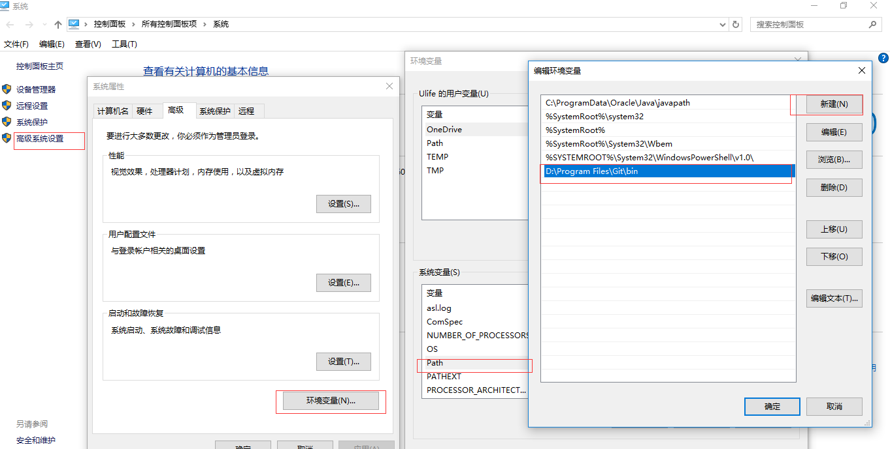
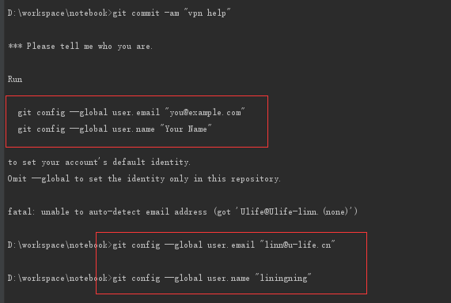
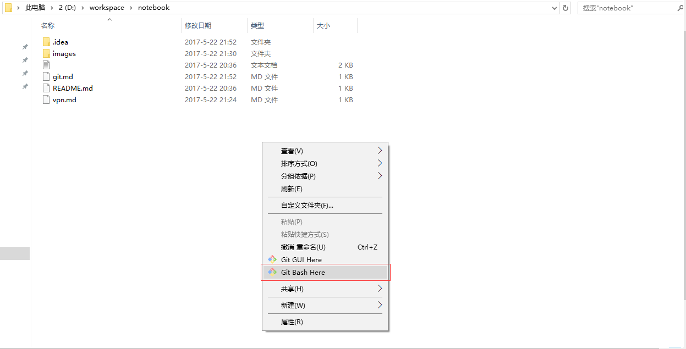
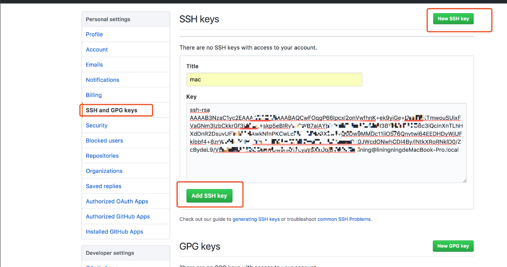

# Git

[首页](https://git-scm.com/)

## 文档

[Git Book](https://git-scm.com/book/zh/v2)

## 安装

1.  下载安装文件

    [下载](https://git-scm.com/downloads)

2.  运行安装文件，都是下一步即可

3.  设置环境变量，让cmd中也可以使用git command

    
     
4.  设置git 用户信息

    

5.  进入文件夹，右击鼠标，点击 `git bash here`， 运行 git bash
    
    

6.  基本概念

* 本地仓库
    
* 暂存区
    
* 远端仓库
    
* 分支

7.常用命令，可以在Git Book 中查看具体怎么使用

        git init
        git clone https://github.com/AimeeLee23/main-station.git
        git remote -v
        git remote add
        git status
        git pull
        git add .
        git commit -am "init"
        git checkout -b "example"
        git merge
        git push
8.ssh key

在访问私有仓库的时候我们会用到用户名密码，但是由于每次操作都要输入用户名密码，很麻烦，所以用ssh key 来代替用户名密码去认证
    
* 查看自己的秘钥
    
```
➜  ~ cd ~/.ssh
➜  .ssh ls
id_rsa      id_rsa.pub  known_hosts
```
    
* 生成秘钥
    
```
➜  .ssh ssh-keygen
    Generating public/private rsa key pair.
    Enter file in which to save the key (/Users/lining/.ssh/id_rsa):
    /Users/lining/.ssh/id_rsa already exists.
    Overwrite (y/n)? y
    Enter passphrase (empty for no passphrase):
    Enter same passphrase again:
    Your identification has been saved in /Users/lining/.ssh/id_rsa.
    Your public key has been saved in /Users/lining/.ssh/id_rsa.pub.
    The key fingerprint is:
    SHA256:gRbgN4l2nZHdtq4VhHRlWXXeWz3GL25bMBTdnLfwcr4 lining@liningningdeMacBook-Pro.local
    The key's randomart image is:
    +---[RSA 2048]----+
    |    ... .+.o..+=B|
    |   . . =.oo.+oo+O|
    |    + B +  o .++B|
    |   . + . .  oo.+=|
    |        S  . .B..|
    |            o. = |
    |           o  o o|
    |          .  . E |
    |              .  |
    +----[SHA256]-----+
    
```
    
* 查看公钥
    
```
➜  .ssh cat ~/.ssh/id_rsa.pub
ssh-rsa AAAAB3NzaC1yc2EAAAADAQAB....
```
* 添加到公钥到自己的ssh-keys
    

    

9.[.gitignore](../.gitignore) 文件

在项目开发的过程中有的时候会产生不需要提交的文件，比如一些 ide 产生的配置文件，只是针对本地的，所以不需要提交，这个时候我们就可以添加 `.gitignore` 文件来忽略这些文件。

这个仓库是现在主流的代码的[.gitignore templates](https://github.com/github/gitignore.git)，直接找到适合自己项目的文件下载复制到自己项目中就好了
        
