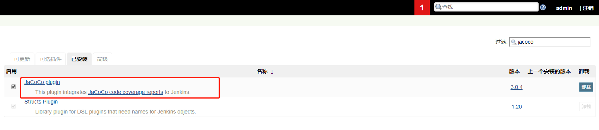
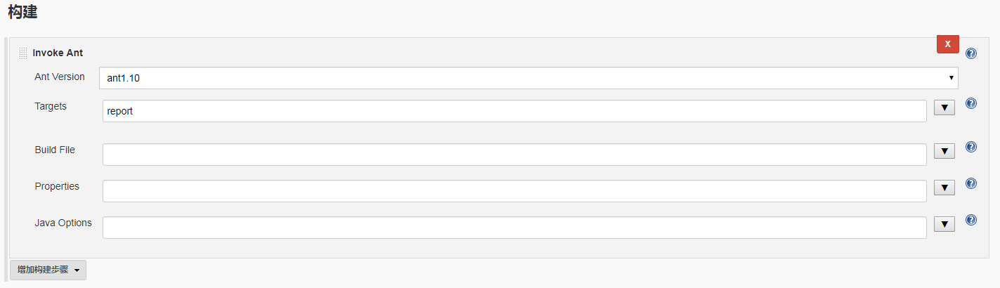
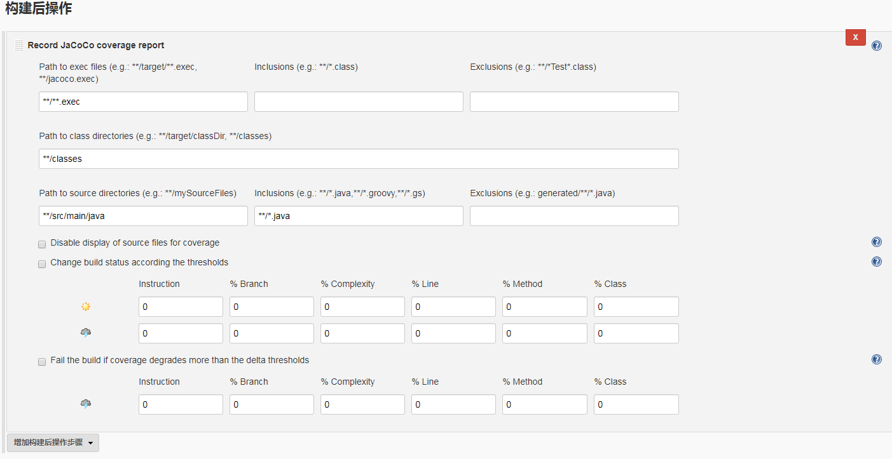
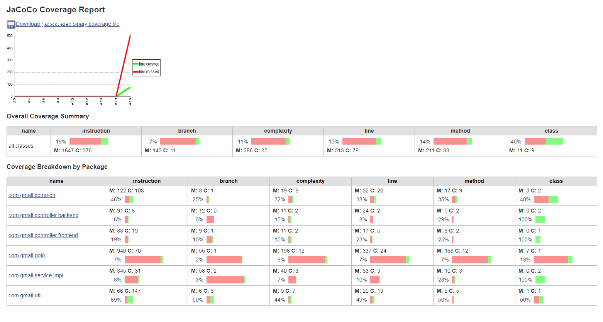
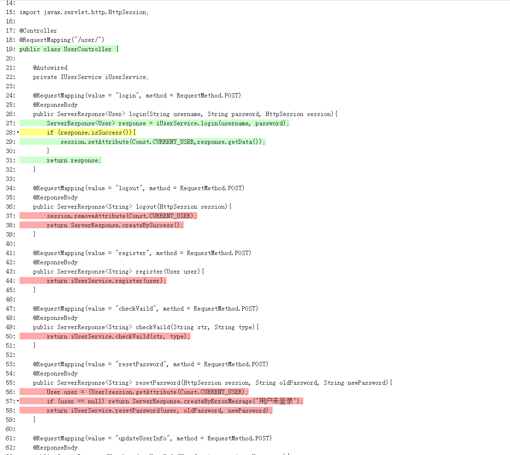

# Jacoco
## 背景
`功能测试后可以查漏补缺，减少测试盲点`

## 选型+原理
- 选择on the fly模式，支持运行中采集覆盖率数据
- JVM中通过-javaagent参数指定特定的jar文件启动Instrumentation的代理程序，代理程序在通过Class Loader装载一个class前判断是否转换修改class文件，将统计代码插入class

## 使用过程：
1. 下载jar包[jacoco](https://www.jacoco.org/jacoco/index.html)
2. 因为java项目是jar直接部署的，所以不在Tomcat中配置，直接在启动命令中加参数  
    - 例子：  
    `java -javaagent:E:/jacoco/jacocoagent.jar=includes=*,output=tcpserver,port=2019,address=10.40.4.131  -jar 原来的服务.jar`  
    - 解释：
        - `E:/jacoco/jacocoagent.jar`是第1部中下载的jar文件  
        - `includes=*`指定注入分析的范围
        - `output=tcpserver`输出格式用server，相当于在tomcat上开了一个访问数据的端口
    - 注意：
        - 端口不能被其他程序占用
        - -javaagent一定要放在命令的最前面

3. 在正常运行过程中，服务器端的Jacoco只是将获取的覆盖率数据保存到内存中，所以需要dump出来  
    Jacoco提供了 Ant、Maven、CLI 多种方式   
    本文中选择Ant，配置build.xml，然后执行`ant report`  
    流程是：先通过dump生成jacoco.exec文件，然后再结合源代码和编译后的.class文件生成覆盖率html报告  
      
    ```xml
    <?xml version="1.0" ?>
    <project name="coverage" xmlns:jacoco="antlib:org.jacoco.ant" default="report">
    
    	<!--Jacoco的安装路径-->
    	<property name="jacocoantPath" value="E:/jacoco/jacocoant.jar"/>
    	
    	<!--最终生成.exec文件的路径-->
    	<property name="jacocoexecPath" value="./jacoco.exec"/>
    	
    	<!--生成覆盖率报告的路径-->
    	<property name="reportfolderPath" value="./report"/>
    	
    	<!--远程jacocoagent的IP-->
    	<property name="server_ip" value="10.40.4.131"/>
    	
    	<!--远程jacocoagent的端口-->
    	<property name="server_port" value="2019"/>
    	
    	<!--源代码路径-->
    	<property name="srcfile" value="E:/GitHub/gmall/src/main/java" />
    	
    	<!--.class文件路径-->
    	<property name="classfilepath" value="E:/GitHub/gmall/target/classes" />
    	
    	<!--让ant知道去哪儿找Jacoco-->
    	<taskdef uri="antlib:org.jacoco.ant" resource="org/jacoco/ant/antlib.xml">
    		<classpath path="${jacocoantPath}" />
    	</taskdef>
    	
    	<!--dump任务,生成.exec文件-->
    	<target name="dump">
    		<jacoco:dump address="${server_ip}" reset="false" destfile="${jacocoexecPath}" port="${server_port}" append="true"/>
    	</target>
    	
    	<!--report任务:源代码、.class、.exec三种文件，生成html覆盖率报告-->
    	<target name="report" depends="dump">
    		<delete dir="${reportfolderPath}" />
    		<mkdir dir="${reportfolderPath}" />
    		<jacoco:report>
    			<executiondata>
    				<file file="${jacocoexecPath}" />
    			</executiondata>
    			<structure name="JaCoCo Report">
    				<group name="jiajiatest"> 
    					<classfiles>
    						<fileset dir="${classfilepath}" />
    					</classfiles>
    					<sourcefiles encoding="UTF-8">
    						<fileset dir="${srcfile}" />
    					</sourcefiles>
    				</group>
    			</structure>
    			<html destdir="${reportfolderPath}" encoding="utf-8" /> 
    		</jacoco:report>
    	</target>
    </project>
    ```

4. 也可以用jenkins的jacoco插件来输出报告   
    - 先安装插件，然后重启jenkins   
      
    - 创建job，构建选择invoke ant，targets其实填dump命令就可以了，因为report的工作会由插件来做  
      
    - 构建后的步骤加一下覆盖率报告，参数默认就行  
          
    - 执行job后的效果：  
        
       
    - 额外说明：最好从远程把代码拉到这个job中编译，这个覆盖率报告插件，好像不能识别job空间之外的文件，这个后续研究
    
## 总结
- 可以提交测试质量
- 可以学习开发的代码
- 缺点就是需要源代码，还要编译
