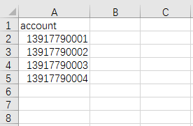
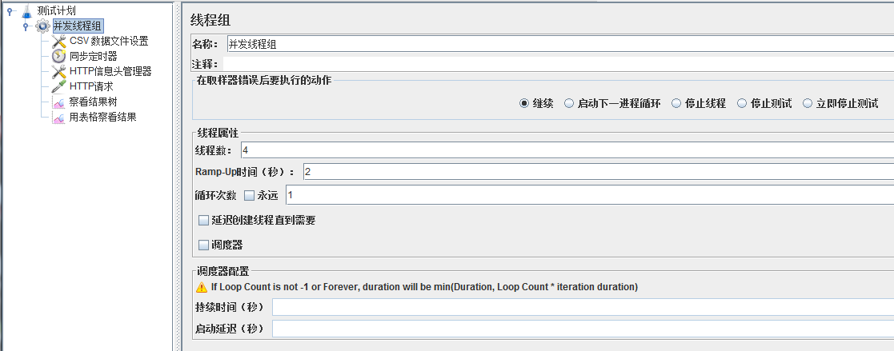
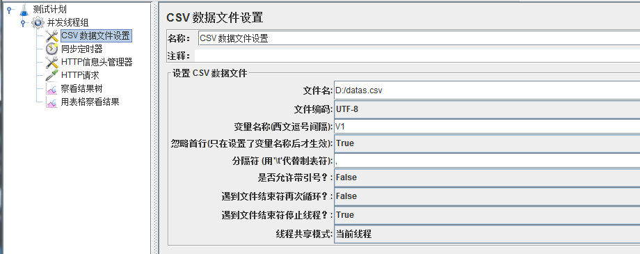
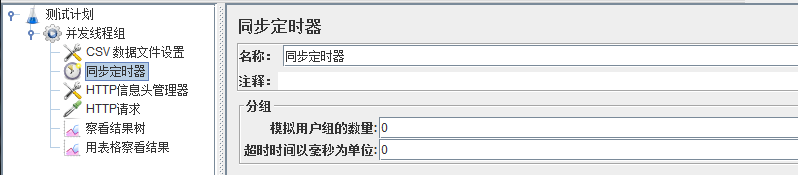
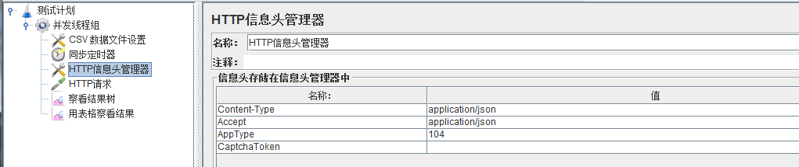
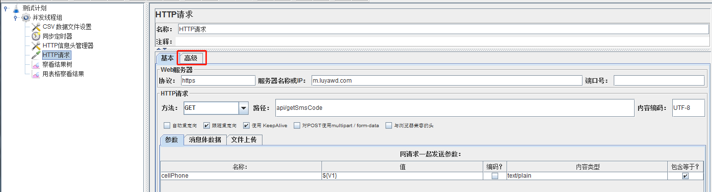
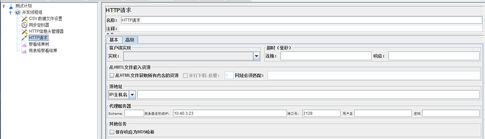
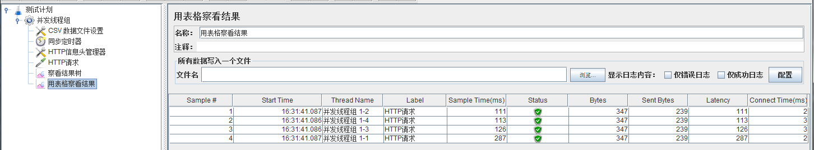

# Jmeter并发   

## 场景分解  
- 从CSV文件中读取不同的用户数据  
- 设置参数，同时执行请求接口  

## 举例：并发获取短信验证码   
1. 创建一个CSV文件，填写4个用户手机号，建议excel另存为csv文件，编码为UTF-8   
    特别注意，不要创建txt文件，然后改后缀名  
       

2. Jmeter中创建一个线程组，并设置“线程数”为需要并发的用户数  
    Ramp-Up时间可以设置为2秒，这个作用是2秒内加载完4个线程，如果跑几百个并发，电脑性能不够，建议把时间拉长一点    
    循环次数和其他的设置，暂时用不到，直接忽略  
      

3. 在这个线程组下，加一个CSV数据文件配置（配置元件）  
    选择刚才的CSV文件，编码选择UTF-8，设置自定义的变量名（多个变量就设置多个）  
    因为CSV文件中，写了一个标题行，所以这里，选择忽略首行  
    因为我们要模拟不同的用户，所以不需要循环，文件结束就停止循环，停止线程   
    一般情况，一个并发放在一个线程组里，所以最好还是选择当前线程组，不选“所有现场”和“当前线程”   
    如果选了当前线程，那么按照线程组的设置，我们就会发起4个请求，请求的都是CSV中的第一条数据   
       

4. 在这个线程组下，加一个同步定时器（定时器）  
    第一个参数的意思是，阻塞线程，等到了限制的值后再一起释放    
    第二个参数的意思是，超过这个时间还没有达到第一个参数的数量时，不再等待直接释放，设置为就是参数不生效   
    如果模拟用户组数量这个参数设置为2，那我们其实就是2个，2个，这样并发  
    如果设置为4，那就是等4个线程齐了，再一起做请求  
    如果设置为大于4，那永远阻塞在这一步了   
    这里设置为0，相当于就是线程组里设置的线程数  
       
    
5. 在这个线程组下，加一个HTTP信息头管理器（配置元件）  
    设置一些必要的header数据  
       
    
6. 在这个线程组下，加一个HTTP请求（取样器）  
    在基本中，配置接口的协议为https，配置服务器名称为域名  
    配置请求访问为GET，配置接口的路径，配置编码为UTF-8  
    添加URL后面的请求参数，设置值为CSV数据文件设置元件中自定义的参数  
        
    点击高级，在高级中，配置接口访问的代理  
            
    
7. 最后添加查看结果树和用表格查看结果（监听器）  

## 其他   
1. 可以看到并发接口其实并不是同一瞬间的，而是在1s内完成的  
     

2. 同步定时器，放在http请求同一个目录下就可以了，因为定时器的优先级比http请求高  
    这里为了好理解，所以，放在了http请求前面  
     