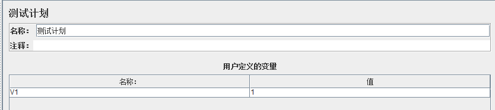
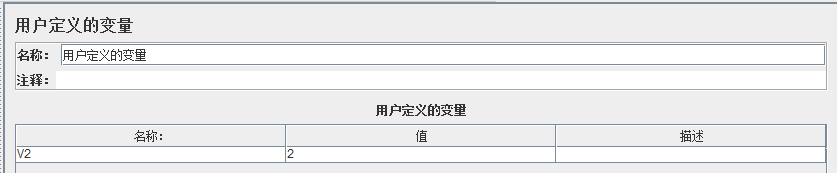
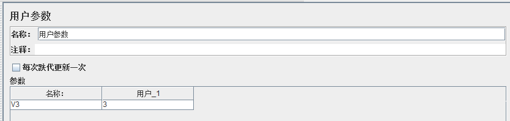
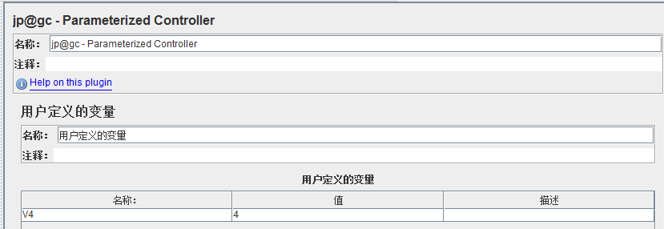
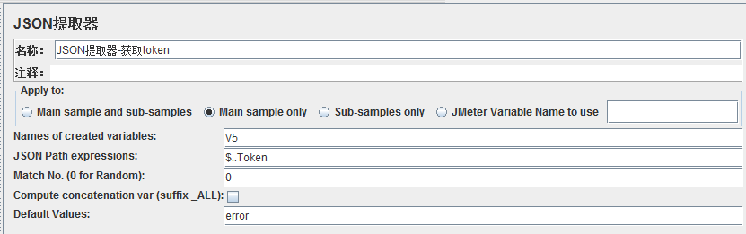
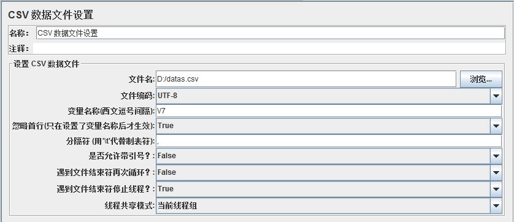
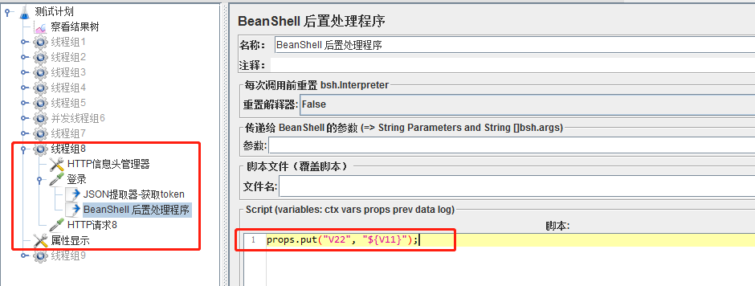
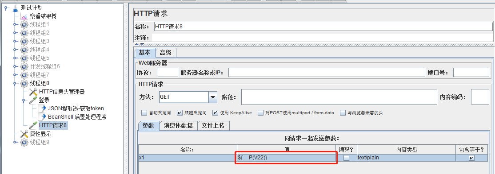
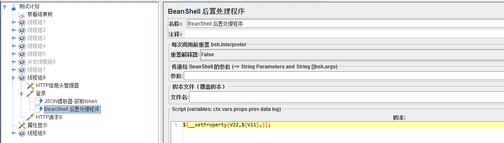

# Jmeter使用参数的注意点     

## 背景  
- 无论是提前定义参数还是接口中提取的参数，使用的场景还是很多的，所以整理一下生效范围和注意点   
    
## 可以设置的参数位置  
1. 测试计划，其中的变量是全局变量，所有线程组都可以用      
        

2. 用户定义的变量，其中的变量是全局变量，所有线程组都可以用   
    如果放在某个线程组中的时候，不能禁用用户定义的变量这个元件的所有父节点，否则就失效了     
           
    
3. 前置处理器-用户参数，其中的变量是局部变量，其他的线程组无法使用     
         
    
4. 插件-参数控制器，其中的变量是局部变量，其他的线程组无法使用         
         

5. 后置处理器-json提取器或正则表达式提取器，这2种提取器中的变量都是局部变量，其他的线程组无法使用    
         

6. 配置元件-CSV 数据文件设置，如果放在线程组外面，就是全局变量，放在某个线程组内，就是局部变量  
         

## 局部变量怎么跨线程使用？参数是没法跨线程的，那就换个思路，使用jmeter属性，常见有2种方法   
1. 使用BeanShell自带功能(前置处理器、取样器、后置处理器三种都一样)     
    拿后置处理器举例：创建登陆接口，使用json提取器提取出token，并命名参数为V11  
    ```
    props.put("V22", "${V11}");
    ```
    这样就把token值添加到jmeter的属性中了，可通过“属性显示”元件查看所有的属性   
    注意①：注意加引号   
    注意②：不要用vars.put()，这个添加的是变量，是局部变量，是不能跨线程组的   
             
      
    怎么使用属性？  
    ```
    ${__P(V22)}
    或
    ${__property(V22)}
    ```
    注意大小写  
              
    
2. 使用jmeter函数助手   
    ```
    ${__setProperty(V22,${V11},)};
    ```
    使用属性的方法和上面一样  
            


- 属性和参数不一样，参数运行结束后就释放掉了，参数在运行结束后会保存下来，只有关闭并重启jmeter，才会释放掉  
- 上面2种方法不仅可以添加属性，还可以把同名属性的值给更新掉，这点也可以利用起来   