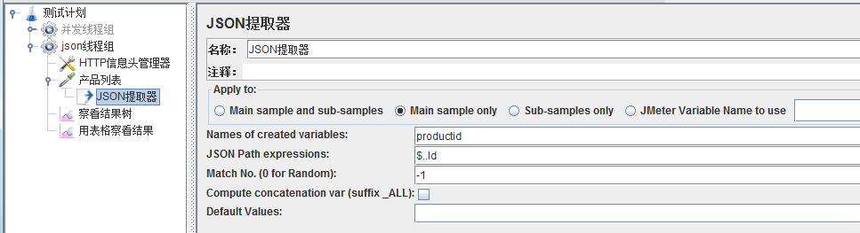
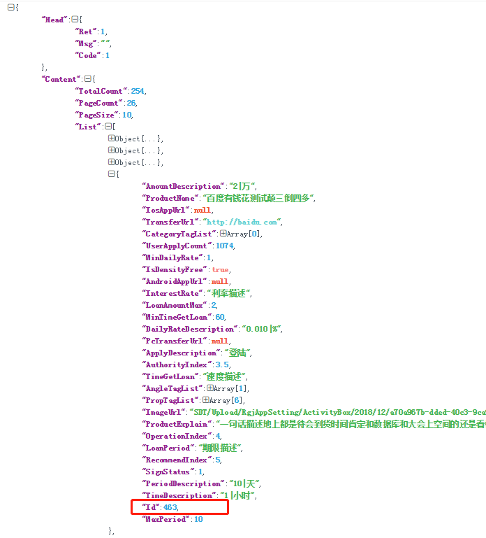
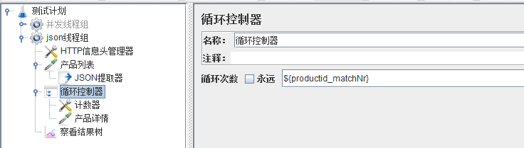
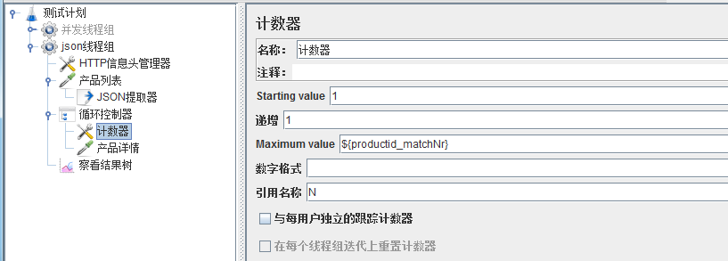
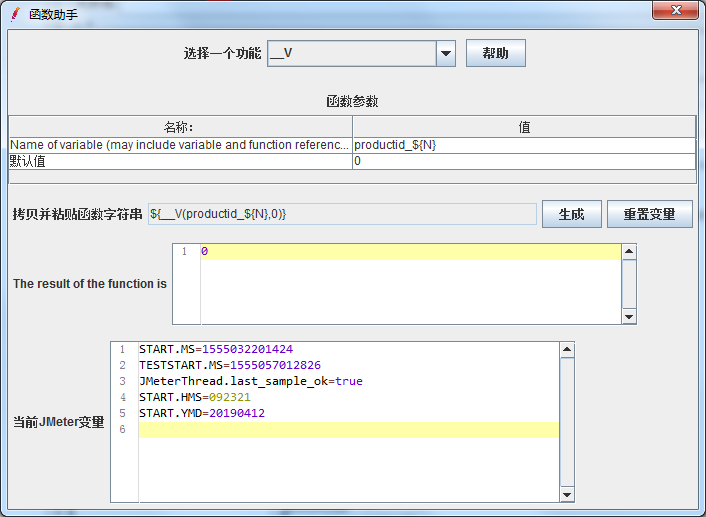
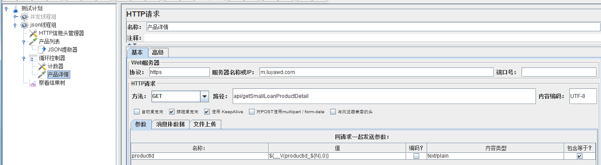
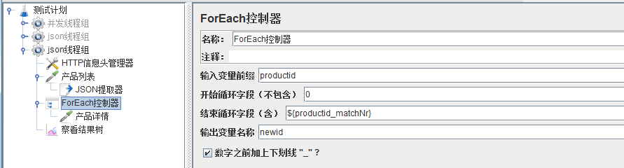
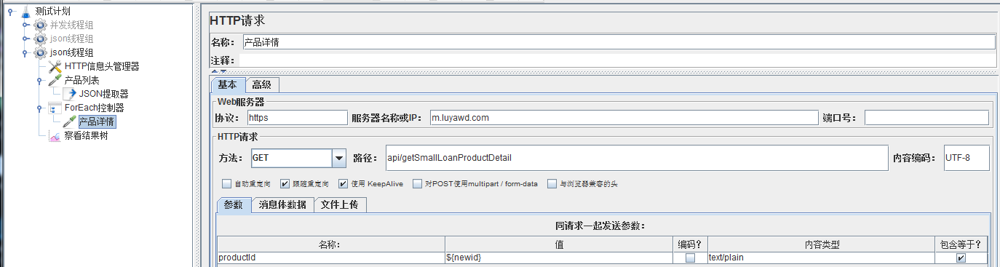

# Jmeter提取数据在其他接口使用  

## 使用背景  
- 很多时候，需要提取上一个接口的返回数据，给下一个接口用   
- 现在的接口大多都是json格式的，所以用json提取器要比正则表达式提取器方便多了  

## 开始提取数据~   
1. 创建一个产品列表的接口，然后在这个列表接口上添加一个json提取器     
        
    
2. 参数说明   
    Names of created variables，自定义变量的名字，这里定了productid   
    JSON Path Expressions，定位变量的值用的  
    Match No，设置为0随机取1个，设置为1取第1个，设置为N取第N个，设置成-1取全部的  
    Compute concatenation var，只有Match No设置为-1才有意义，匹配所有的值后，返回一个列表  
    Default Values，匹配不到数据时，返回的值，如果不填就是空  
    
3. 产品列表接口返回的数据如下图，于是json path expressions设置为$..Id   
   注意是区分大小写，要不就匹配不出来了，可以看到比正则表达式方便多了  
        

4. 表达式写法    

    | **JSONPath表达式**       | **效果**                      |
    | -------------------- | ------------------------- |
    | $.Content.List[*].Id | 所有的产品Id              |
    | $..Id                | 所有的产品Id              |
    | $.Content.*          | content中的所有子节点内容 |
    | $.Content..Id        | 所有的产品Id              |
    | $..List[2]           | 第三个产品                |
    | $..List[-1:]         | 最后一个产品              |
    | $..List[:2]          | 前两个产品                |
    | $..List[?(@.Id)]     | 留下有Id这个字段的产品    |
    | $..List[?(@.Id<10)]  | 留下Id小于10的产品        |
    
    具体可查看https://github.com/json-path/JsonPath  

## 循环使用数据（一般有2种方式，一是加个计数器，二是用Jmeter自带的foreach控制器）~   
#### 一、计数器+循环控制器方式   
1. 产品列表接口一页返回10个产品，所以提取到的参数有10个，分别是productid_1到productid_10   
    所以先在线程组下加一个循环控制器，循环次数用json提取器生成的${productid_matchNr}代替   
             
    
2. 然后在循环控制器下加一个计数器（配置元件）  
    我们需要1~10这10个数字，所以配置1开始，1递增，最大值填${productid_matchNr}  
    引用名称随便填，这里取N，这样N就是1~10  
         

3. 一般取变量数据的格式是${变量名}，这里变量名也是变化的，所以要转换一下  
    打开Jmeter菜单栏-工具中的函数助手，输入我们的变量格式和默认值，点击生成就可以了   
         
    
4. 在循环控制器下加一个产品详情的http请求    
    在请求参数中填入上面生成的变量表达式     
         

#### 二、foreach控制器方式  
1. 在线程组下加一个foreach控制器  
    之前提取的变量正好是有下滑线的，所以勾了最后一个“数字之前加上下划线”，等同于在“输入变量前缀”里面自己加一个下划线  
    注意开始值时不包含的，所以设置开始值为0，结束值为之前提取的${productid_matchNr}  
    输出变量名称这个随便定义，定义后，原来那个变量就不用了，相当于帮老变量换了一个新名字，这里定义为newid     
         
    
2. 在foreach控制器加一个产品详情的http请求    
    在请求参数中填入上面自定义的新变量newid     
             
    

    