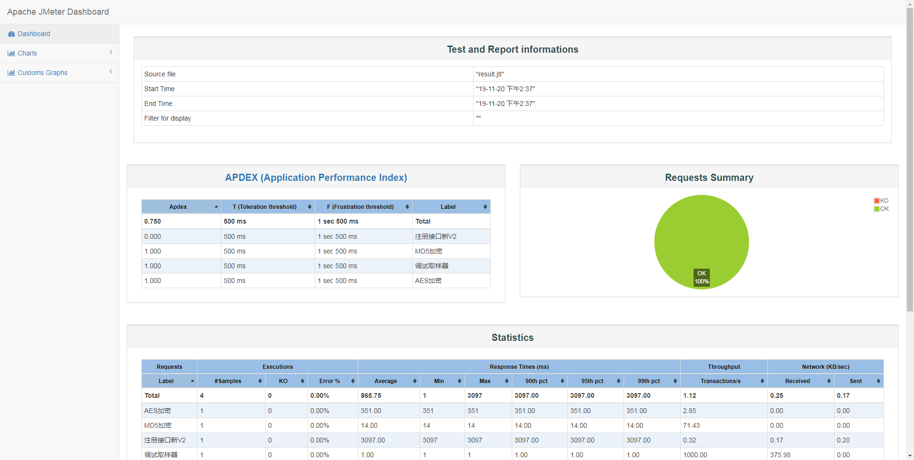

# Jmeter无界面执行并生成报告 

## 无界面执行   
`jmeter -n -t D:\脚本.jmx -l D:\result.jtl -e -o D:\ResultReport`  
参数说明:  
- -n: 非GUI模式执行JMeter
- -t: 测试脚本文件路径
- -l: 指定生成测试结果文件路径
- -e: 生成测试报告
- -o: 指定测试报告的存放路径

执行的时候，需要在D:\apache-jmeter-5.1.1\bin目录下执行，或把jmeter.bat所在目录配到环境变量path中  

## 生成的报告   
   

