# Jmeter负载测试   

## 背景
- 除了一瞬间的并发测试外，我们有时候还需要长时间的负载测试   
- 本文主要模拟线性、步进、峰值三种负载场景 

## 使用前准备  
- 安装jmeter的插件管理器  
    下载[插件管理jar包](pic/fuzai/jmeter-plugins-manager-1.3.jar)，放在jmeter安装目录下的lib\ext文件夹中，重启jmeter就可以了   
    界面上有2个地方可以打开插件管理器   
    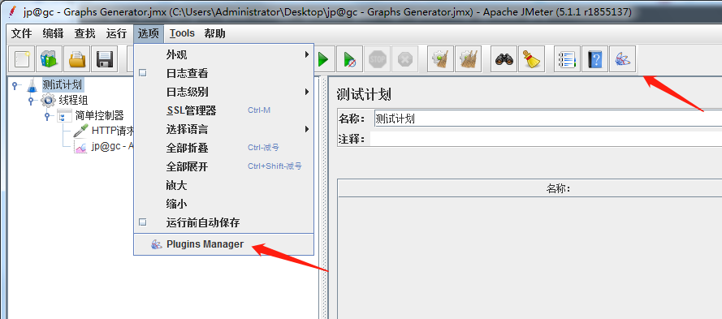   
    
- 下载插件：Custom Thread Groups和3 Basic Graphs，安装完会自动重启   
    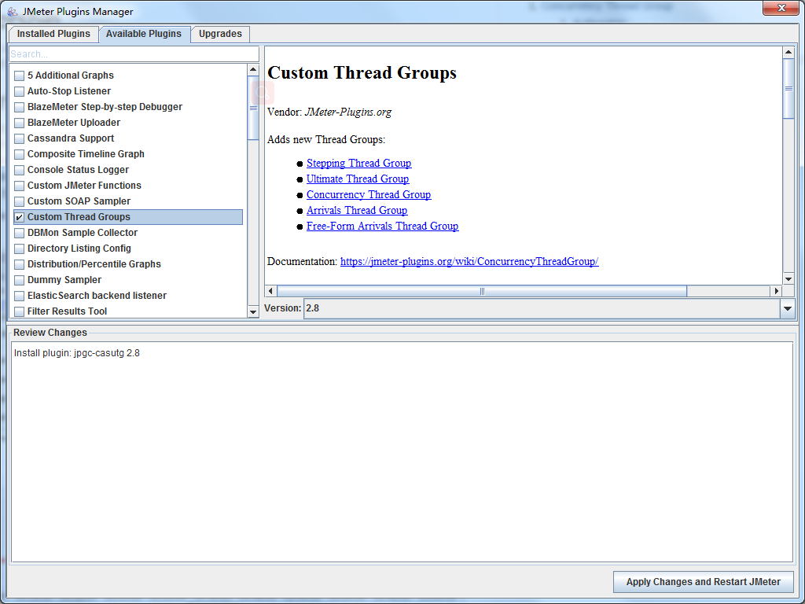   
    

## 线性负载（模拟用户线性增加）
1. 添加jmeter自带的普通线程组，在线程组中添加需要负载的接口，最后我们再加一个观察线程的监听器（jp@gc-Active Threads Over Time）  
    模拟20个用户，20s内达到20个，持续时间为40s，整个过程为60s
    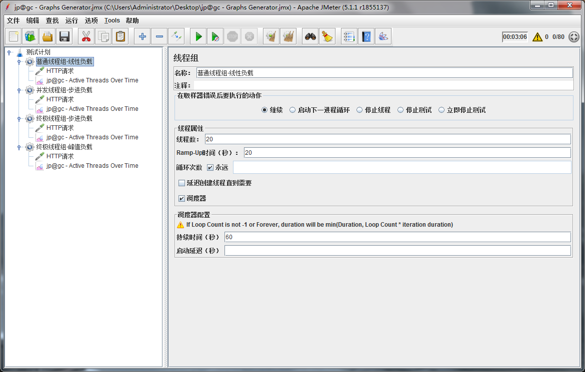   
    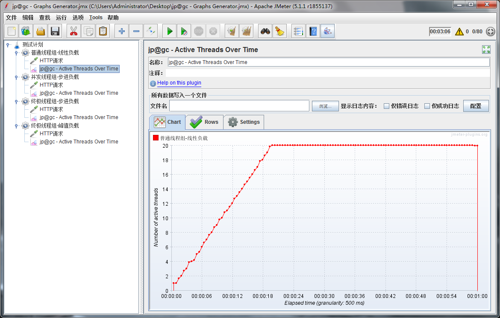       

## 步进负载（模拟用户阶段式增加，有2种线程组可选）
1. 使用并发线程组插件（bzm-Concurrency Thread Group）    
    同上面，设置并发线程组，添加接口，添加监听器   
    模拟5个用户开始，每5s一下增加5个，一直到20个，持续40s，整个过程为60s  
    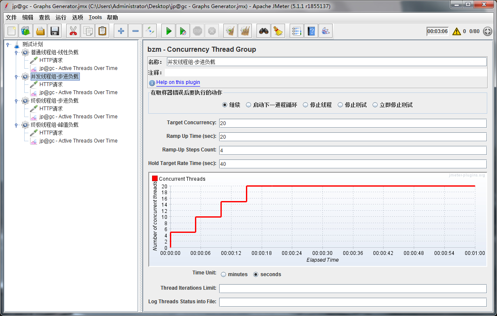   
    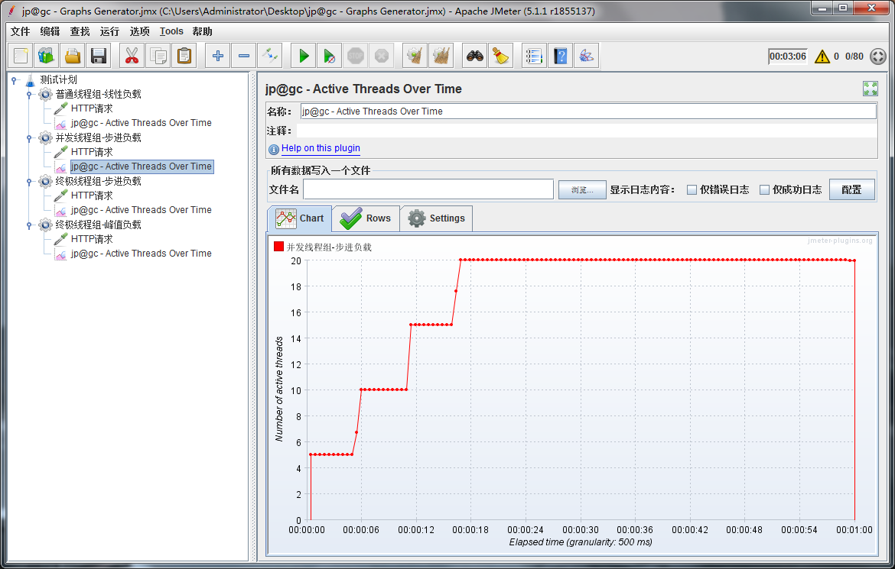          

2. 使用终极线程组插件（jp@gc-Ultimate Thread Group）  
    同上面，设置并发线程组，添加接口，添加监听器    
    模拟5个用户开始，每30s一下增加5个，一直到20个，持续90s，整个过程180s  
    可以理解为有4个单独的线程组，每个都可以单独设置线程数量、延时启动时间、加速时间、持续时间和关闭时间  
    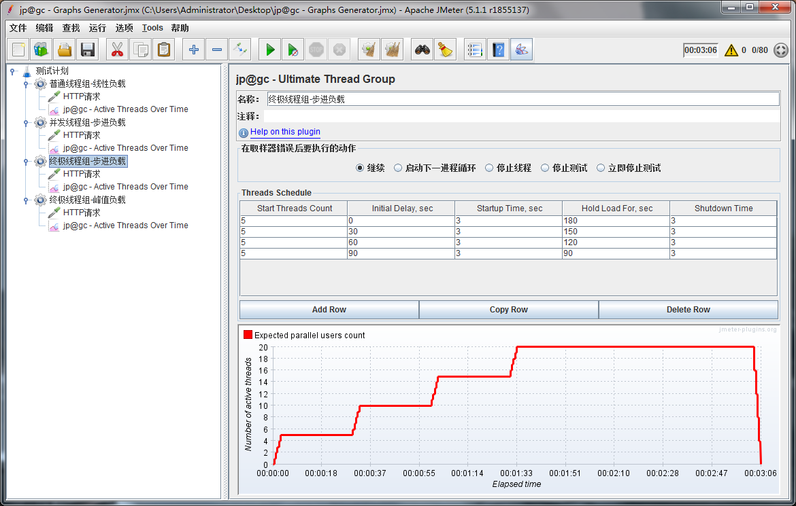   
    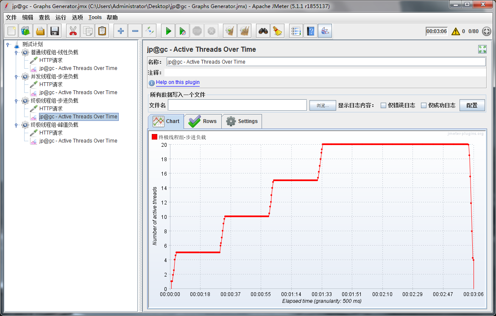        

3. 可以看到并发线程组只能平均等分的增加用户数，终极线程组更加灵活   

## 峰值负载（模拟用户爆发式增加）  
1. 还是使用终极线程组插件，添加接口，添加监听器  
    模拟平时是5个用户，60s的时候突然来了15个用户，持续了10s，然后15个用户又走了  
    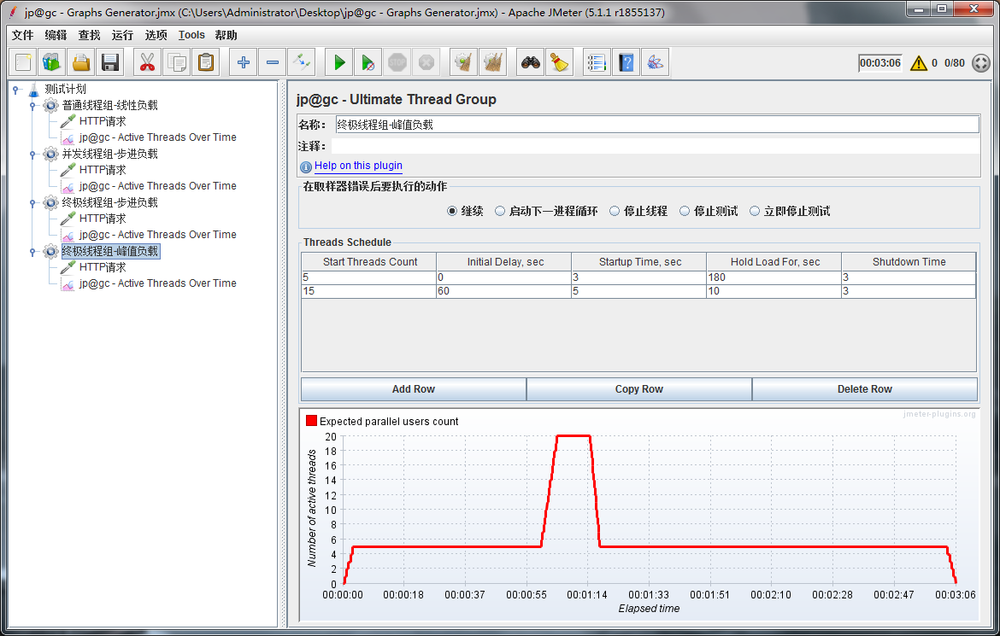   
    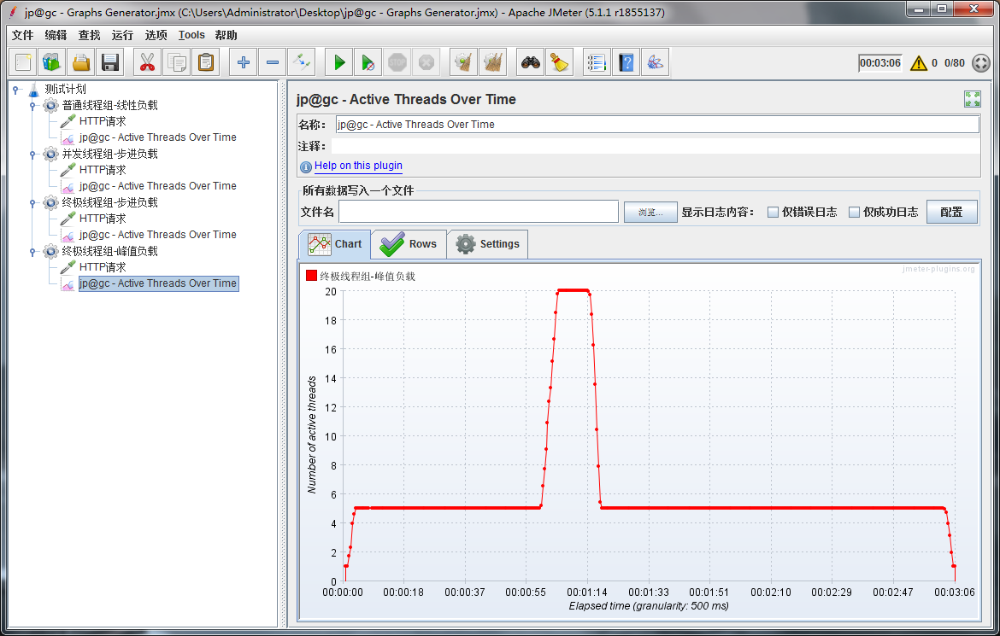     

## PS  
- 为了避免电脑卡住，本地电脑线程数量不要设置太大，一般400以下
- 负载开始时，关闭无用软件，释放更多的cpu和内存资源给jmeter
- 测试的时候，本机不存在性能问题的时候，服务端的负载测试才是准确的  
- 为了避免生成过多的日志和文件，建议去勾选没用的数据（特别是返回信息，一般这个最大）  
    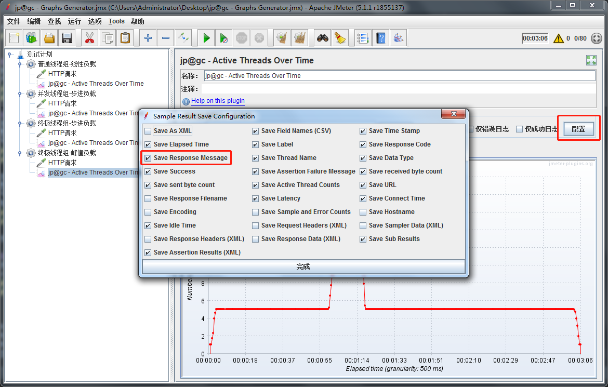    
