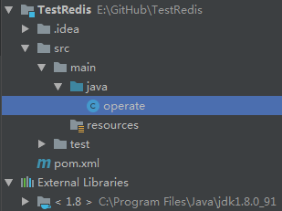
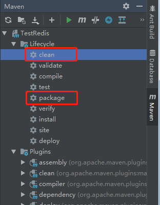
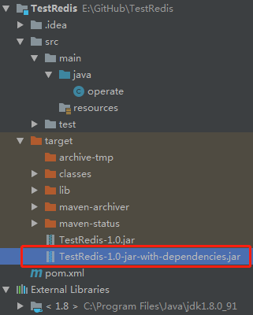
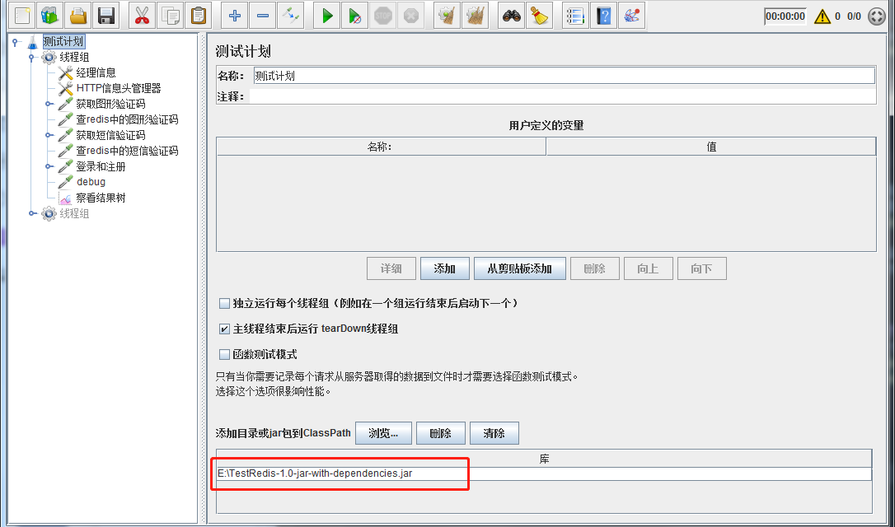
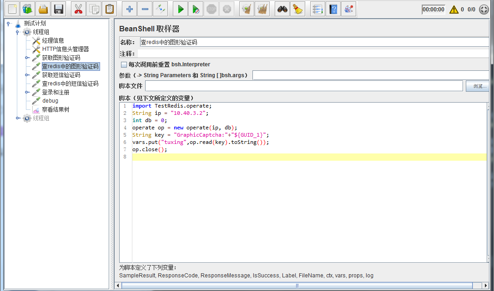

# Jmeter第三方jar包   

## 背景  
- 测试的时候需要访问redis，没有可以直接用的插件，所以需要自己做一个    

## 制作jar包   
1. 创建一个maven项目，添加operate类  
       
    
2. 编写operate类
    ```java
    import redis.clients.jedis.Jedis;
    import java.util.Set;
    
    public class operate {
        private Jedis jedis;
        /** 构造**/
        public operate(String ip, int dbno){
            jedis = new Jedis(ip,6379);
            jedis.connect();
            jedis.select(dbno);
        }
    
        /** 查询数据**/
        public String read(String key) { return jedis.get(key); }
    
        /** 更新数据**/
        public void update(String key, String value) { jedis.set(key, value); }
    
        /** 删除数据**/
        public void delete(String key) { jedis.del(key); }
    
        /** 删除这个db下所有的数据**/
        public void delall() {
            Set<String> keys = jedis.keys("*");
            for (String key : keys) {
                jedis.del(key);
            }
        }
    
        /** 关闭redis连接**/
        public void close() {
            jedis.disconnect();
        }
    }
    ```    
    
3. 配置pom.xml  
    ```xml
    <dependencies>
        <dependency>
            <groupId>redis.clients</groupId>
            <artifactId>jedis</artifactId>
            <version>3.0.1</version>
        </dependency>
    </dependencies>
    <build>
        <plugins>
            <plugin>
                <groupId>org.apache.maven.plugins</groupId>
                <artifactId>maven-dependency-plugin</artifactId>
                <version>3.0.1</version>
                <executions>
                    <execution>
                        <id>copy-dependencies</id>
                        <phase>package</phase>
                        <goals>
                            <goal>copy-dependencies</goal>
                        </goals>
                        <configuration>
                            <outputDirectory>${project.build.directory}/lib</outputDirectory>
                            <overWriteReleases>false</overWriteReleases>
                            <overWriteSnapshots>false</overWriteSnapshots>
                            <overWriteIfNewer>true</overWriteIfNewer>
                        </configuration>
                    </execution>
                </executions>
            </plugin>
            <plugin>
                <groupId>org.apache.maven.plugins</groupId>
                <artifactId>maven-assembly-plugin</artifactId>
                <version>3.1.0</version>
                <configuration>
                    <archive>
                        <manifest>
                            <mainClass></mainClass>
                        </manifest>
                    </archive>
                    <descriptorRefs>
                        <descriptorRef>jar-with-dependencies</descriptorRef>
                    </descriptorRefs>
                </configuration>
                <executions>
                    <execution>
                        <id>make-assembly</id> <!-- this is used for inheritance merges -->
                        <phase>package</phase> <!-- 指定在打包节点执行jar包合并操作 -->
                        <goals>
                            <goal>single</goal>
                        </goals>
                    </execution>
                </executions>
            </plugin>
        </plugins>
    </build>
    ```
4. ide右侧快捷键打包(先clean后package)  
     
   
5. target目录下获取jar包  
     
 

## jmeter中使用jar包    
1. 在jmeter的测试计划中添加jar包的目录  
             

2. 添加BeanShell取样器，编写java脚本    
         
    
3. 举例：上图中的脚本获取到图形验证码赋值给了变量"tuxing"   
    之后脚本中使用变量的格式"${tuxing}" 
