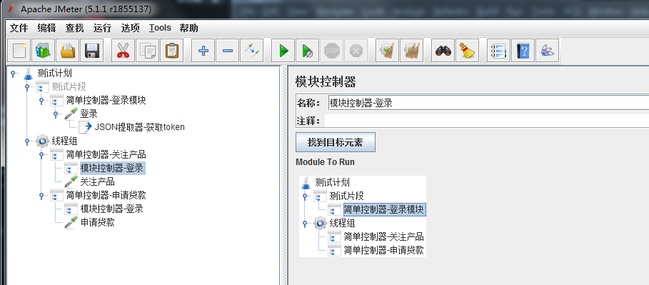

# Jmeter脚本模块化     

## 背景  
- 测试脚本中接口越来越多，有一些常用的场景（例如登录场景），当登录相关的接口有修改的时候，所有的脚本都要修改一遍，很麻烦   
- 所以要利用开发的思想，模块化这些场景（以登录场景为例子）  

## 前提准备   
- 安装jmeter的插件管理器  
    [在之前负载测试的文档中有介绍](http://10.40.3.32/Test/others/blob/master/jmeter/Jmeter%E6%A8%A1%E6%8B%9F%E5%90%84%E7%A7%8D%E8%B4%9F%E8%BD%BD%E5%9C%BA%E6%99%AF.md)   
- 下载插件：Parameterized Controller & Set Variables Action   
       
    
## 脚本模块化  
1. 在测试计划下添加一个测试片段（测试片段除了被模块控制器导入外，都不会参与脚本运行的）  
    按下图添加1个简单控制器，添加登录接口，添加json提取器  
    添加简单控制器是为了后面，在模块控制器中方便选择  
        

2. 在测试计划下按下图添加1线程组，按2个业务添加2个简单控制器  
    在简单控制器下添加模块控制器，并选中测试片段中的登录模块就可以了       
           
    
3. 经测试，提取的token在关注产品接口和申请贷款接口都可以正常使用   
    如果2个模块控制器放在不同的线程组里，也是可以正常使用的   
 

## 模块化之后的传数据问题     
##### 登录部分模块化以后，如果是不同用户登录的场景，就要使用参数化控制器了   
1. 在2个模块控制器上一层都加1个参数控制器，自定义参数var1、var2，名字随便取       
        
        

2. 修改测试片段中的登录接口，用户名和密码使用var1、var2，这样就可以了   
        
    
    
3. 经测试，在关注产品和申请贷款两个接口中，入参token会取不同的值    
    实际上就是关注产品接口中var1、var2、token的值，都会在申请贷款接口中被更新为新值    
    

## PS  
- Module Controller（模块控制器）可以调用任何位置的元件，跨线程组，不在线程组都没关系  

## PS2  
- 在参数控制器中的变量不建议使用${}这种引用，原因有2个，举例（2个参数控制器的参数配置如下）：  
        
        
- 原因一：  
    如果2个参数控制器不在一个线程组中  
    第二个参数控制器中var2就是等于${var1}字符串，并不是13900020002或者13900010001  
    
- 原因二：
    如果2个参数控制器在一个线程组中  
    第二个参数控制器中var2等于第一个参数控制器中的var1（13900010001）   
    但是2个接口请求完后，两个var1、var2都会等于13900020002   

- 总结下来就是，配置参数控制器时，最好不要参数化，如果使用，定义的变量名不要相同  
