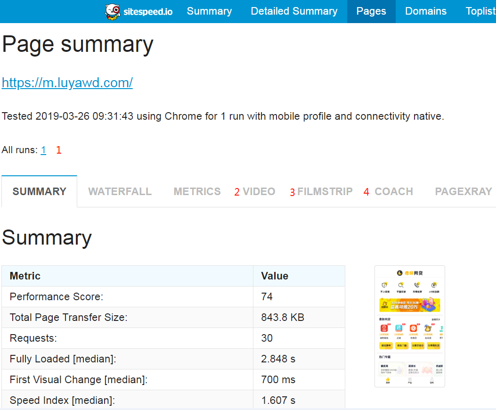

# sitespeed.io使用总结    

## 简介  
- sitespeed.io是一款测试前端web性能的工具   
- 是一系列工具的集合，可以单独使用其中的每一项工具   
- 支持Firefox和Chrome浏览器  
- [github地址](https://github.com/sitespeedio/sitespeed.io)  
    
## 环境（现成环境，10.40.4.200）  
1. 先安装好docker环境（docker安装最方便，其他不研究）  
2. docker pull sitespeedio/sitespeed.io    

## 单独使用  

```
PC-web测试 
  docker run --rm -v "$(pwd)":/sitespeed.io sitespeedio/sitespeed.io https://www.luyawd.com/   
  
M-web测试（默认是chrome iPhone 6）  
  docker run --rm -v "$(pwd)":/sitespeed.io sitespeedio/sitespeed.io https://m.luyawd.com/ --mobile  
  
多个页面一起测试  
  docker run --rm -v "$(pwd)":/sitespeed.io sitespeedio/sitespeed.io https://AAA/  https://BBB/  
  
一个页面测试5次（不设置，默认跑3遍）
  docker run --rm -v "$(pwd)":/sitespeed.io sitespeedio/sitespeed.io https://www.luyawd.com/ -n 5
  
默认是chrome，设置为Firefox
  docker run --rm -v "$(pwd)":/sitespeed.io sitespeedio/sitespeed.io https://www.luyawd.com/ -b firefox  
  
另外解析HAR，比较HAR，HAR转JSON，android真机，弱网模拟，代理设置，都先不研究了
设置user agent和分辨率去模拟手机不同的分辨率不好用，感觉有bug
```

## 说明  
1. 执行完docker命令后，会在当前目录下生成sitespeed-result文件夹，  
    文件夹中按url分为2级子文件夹，2级文件夹下面，再按执行时间分为3级子文件夹  
    因为安装的centos没有界面，所以用filezilla等工具，下载sitespeed-result文件夹到本地，使用浏览器打开index.html  
      
  
2. 首页界面如下，都是一些得分，导航是按各个维度统计的性能数据和总结  
      

3. 比较感兴趣的是导航pages下分url展示的详情（步骤1→2）    
       
  
    下图步骤1是切换页面的，如果跑了3次，这边就是1-2-3，可以切换到每1次跑的数据详情  
    下图步骤2是这1次跑的视频录像  
    下图步骤3是这1次跑的图形切片  
    下图步骤3是这1次跑完后的建议          
        
    
## jenkins集成（docker容器）  
1. 因为要在容器中使用docker命令，所以要自定义一个jenkins的镜像   
    步骤：  
    ①首先建一个文件夹，然后创建并编写Dockfile  
      这里一定要注意查一下本机的dockerGid，不一定是994    
      查看命令： vi /etc/group  
    
    ```
    FROM jenkins/jenkins:lts
    
    USER root
    ARG dockerGid=994
    
    RUN echo "docker:x:${dockerGid}:jenkins" >> /etc/group
    
    USER jenkins
    
    ```
    
    ②创建编写docker-compose.yml  
    
    ```
    version: '2.1'
    services:
      myjenkins:
        build: .
        ports:
          - 38080:8080
          - 30000:50000
        
        #privileged: true
        volumes:
            # 挂载到宿主机，持久化数据
            - ~/volumes/jenkins_home:/var/jenkins_home
            # 在docker容器中使用docker命令（不安全），使用宿主机的docker
            - /var/run/docker.sock:/var/run/docker.sock
            - /usr/bin/docker:/usr/bin/docker
            # 缺少这个文件，执行的时候有报错
            - /usr/lib64/libltdl.so.7:/usr/lib/x86_64-linux-gnu/libltdl.so.7
            
    ```
    ③执行 docker-compose up --build  -d  
    ④查看jenkins是否可以正常使用（举例：10.40.4.200:38080）  
    
2.  安装HTML Publisher插件    
    安装后重启jenkins，过程省略。。。  
      
 
3.  创建jenkins任务  
      
      
    参数说明：  
    --rm  删掉用完的容器  
      
    -v /root/volumes/jenkins_home/workspace/webdata:/sitespeed.io  任务挂载宿主机的物理路径，千万注意项目名称一定要对  
      
    --outputFolder output  指定输出路径为jenkins_home/workspace/webdata/output  
        
    --mobile  模拟手机去访问web  
     
    -n 1  性能测试，只执行1次   
    
    构建后操作，目录需要设置为上面指定的output/ 路径，这样htmlreport就能取到数据了  
    
4. 执行后可以在项目左侧列表，查看报告  
       
    
5. 说下缺点：  
    - 这个报告插件看不了视频，锚点也不好用，还有很多js报错，只能直接去找视频文件看  
    - 指定输出路径后，只保留最新的一份报告了，单独使用的时候是按时间戳分开建了文件夹
      
## 后续考虑    
- 脚本的执行（自动化） 参考链接：https://www.sitespeed.io/documentation/sitespeed.io/scripting  