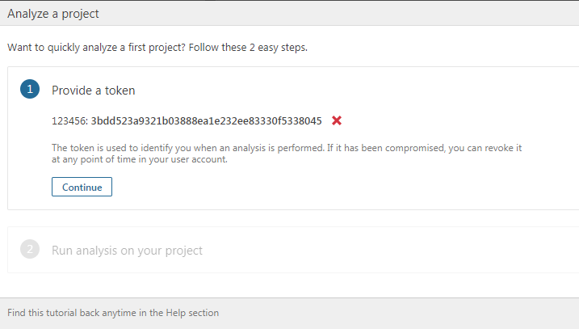
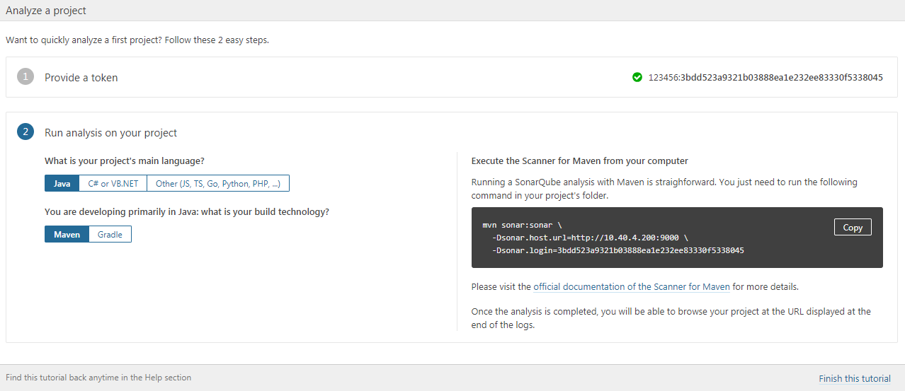
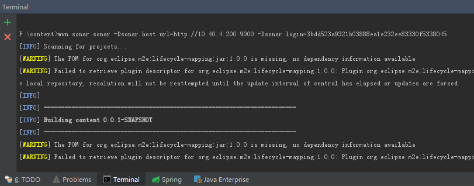
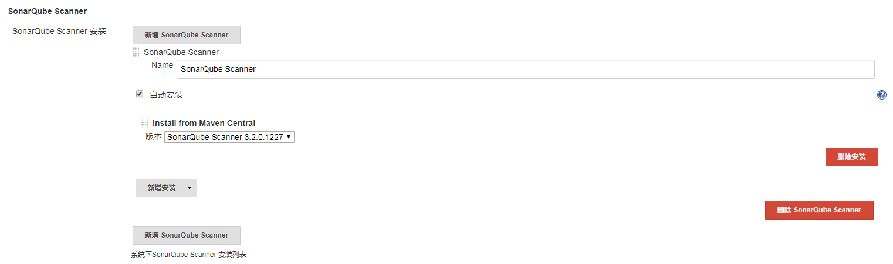
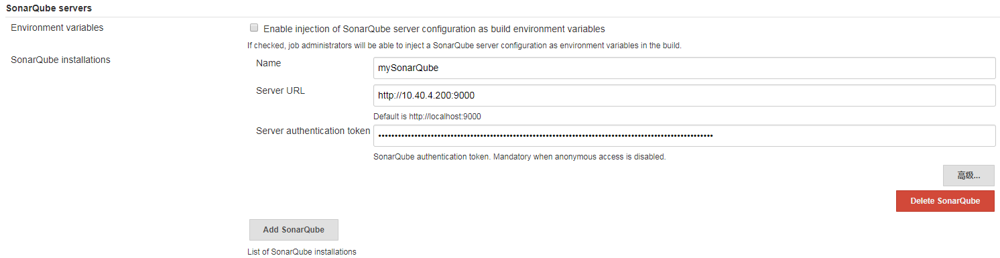
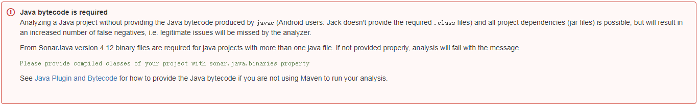
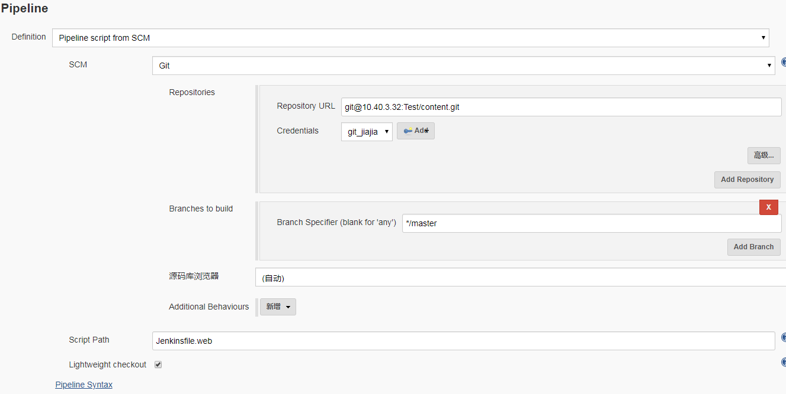
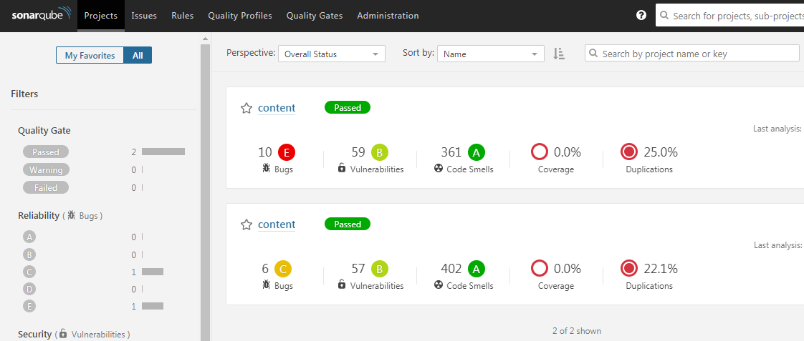

## 核心功能：
##### 1. 一个开源、免费的代码质量管理平台
##### 2. ...还在研究中

## 链接：
##### [官网](https://www.sonarqube.org/)

## 安装过程：
##### 1. jdk(我选了1.8)
##### 2. mysql（docker）  

安装mysql

```
docker pull mysql:5.7
```

启动mysql（设置端口、账号密码、本地路径）

```
docker run --name mysql-5.7 -v /root/volumes/mysql:/var/lib/mysql -e MYSQL_ROOT_PASSWORD=123456 -p 3306:3306 -d mysql:5.7
```

建数据库
```
docker exec -it mysql-5.7  bash
mysql -uroot -p
123456
show databases;
CREATE DATABASE db_sonar  DEFAULT CHARSET utf8;
```

##### 3. 安装Sonarqube（docker）

获取镜像文件

```
docker pull sonarqube
```

启动
```
docker run --name Sonarqube -p 9000:9000 -e "SONARQUBE_JDBC_USERNAME=root" -e "SONARQUBE_JDBC_PASSWORD=123456" -e "SONARQUBE_JDBC_URL=jdbc:mysql://10.40.4.200:3306/db_sonar?useUnicode=true&characterEncoding=utf8" -d sonarqube:latest

```


## 初始化Sonarqube：
##### 打开网页  
http://10.40.4.200:9000  
第一次启动非常慢！估计是在初始化数据库

##### 登录  
首次登录后账号密码居然不是我上面设置的root/123456，这个。。。  
看了下数据库，账号是admin，猜了下密码，果然也是admin，登进去了，给跪了！！！

##### 生成token:
   

##### 生成命令:
  


## 使用方式：
### 1. 直接在idea中使用命令:（so easy~~）  

  

### 2. jenkins持续集成:  
- ①在系统管理--插件管理中，安装SonarQube Scanner for Jenkins插件，安装后重启jenkins  

- ②在系统管理--全局工具配置中，设置扫描工具

  

- ③在系统管理--系统设置中，配置SonarQube的servers地址，其中的token就是上面mvn命令中的login的值  

  

- ④在项目根目录下创建sonar-project.properties、Jenkinsfile.web这两个文件  

###### sonar-project.properties:  

```
# must be unique in a given SonarQube instance
sonar.projectKey=content
# this is the name and version displayed in the SonarQube UI. Was mandatory prior to SonarQube 6.1.
sonar.projectName=content
sonar.projectVersion=1.0
 
# Path is relative to the sonar-project.properties file. Replace "\" by "/" on Windows.
# This property is optional if sonar.modules is set. 
sonar.sources=.
 
# Encoding of the source code. Default is default system encoding
sonar.sourceEncoding=UTF-8

# 这个一定要加！！！官方要求的，见下图
sonar.java.binaries=.

```

  

###### Jenkinsfile.web  

```
#!/usr/bin/env groovy
node {
    stage('checkout') {
        checkout scm
    }
    
    stage('check java') {
        sh "java -version"
    }
    
    stage('SonarQube analysis') {
        // requires SonarQube Scanner 2.8+
        def scannerHome = tool 'SonarQube Scanner';
        withSonarQubeEnv('mySonarQube') {
            sh "${scannerHome}/bin/sonar-scanner"
        }
    }
}
```

- ⑤创建一个Pipeline（流水线）任务  
需要注意私有项目的话，需要添加jenkins凭证，这个凭证需要进入jenkins容器中生成，  
直接在linux服务器上生成是错误的，生成的公钥添加在gitlab上，私钥添加在jenkins上
  


- ⑥构建成功后，就能在Sonarqube网页上查看扫描结果了：  

 


## 学习总结：  

- 配置踩了很多坑，百度的教程也是坑，要自己琢磨官方文档
- 平台的使用还是熟悉中，扫出来也不一定是bug


